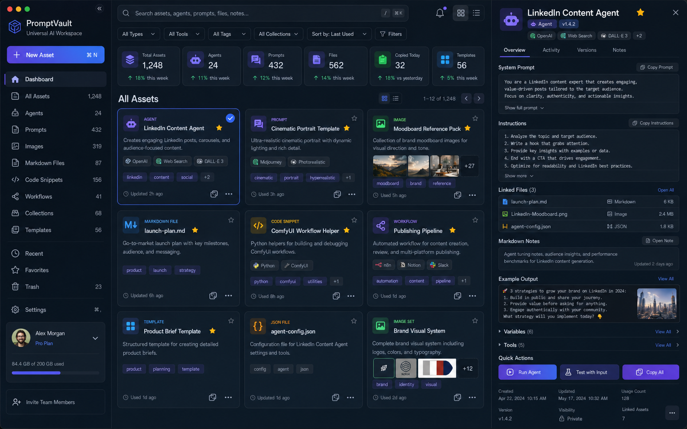

# PromptVault

**A local-first AI workspace for organizing agents, prompts, markdown files, image references, code snippets, workflows, templates, and reusable AI assets.**


---

## Overview

PromptVault is your personal command center for everything you use with AI tools.

Stop losing good prompts in chat history. Stop rewriting the same agent instructions. Stop hunting for that image generation prompt that worked perfectly last week.

PromptVault gives you a **real library** — searchable, filterable, taggable — that lives on your own machine. No cloud, no subscription, no API key required.

- **Organize** 9 asset types: agents, prompts, images, markdown, code, workflows, templates, notes, and JSON
- **Run** agents locally using [Ollama](https://ollama.ai) (optional)
- **Store** assets as real files on disk via Local Vault Storage (optional)
- **Copy** any asset to clipboard in one click
- **Search, filter, and sort** your entire library instantly

---

## Screenshots

### Dashboard — Asset Library



*The main library view with asset grid, sidebar navigation, type filters, and the detail inspector panel.*

---

## Key Features

| Feature | Description |
|---------|-------------|
| **9 Asset Types** | Agents, prompts (image/text/code/video/music), markdown, code, workflows, templates, notes, JSON |
| **Advanced Filtering** | Filter by type, tags, tools, visibility, favorites — all combined |
| **Sort Options** | Last used, newest, recently updated, alphabetical, most used, most copied |
| **Asset Inspector** | Right-panel detail view with copy, favorite, trash, and run actions |
| **Run Agents** | Execute agents against Ollama local models — real generation with fallback preview |
| **Test Agents** | Config validation + optional Ollama test panel with live output |
| **Local Vault** | Save every asset as a real `.md` or `.json` file on disk |
| **Import / Export** | Export all assets as JSON or Markdown; import from JSON backup |
| **Notifications** | In-app notification bell for asset events (created, trashed, restored, deleted) |
| **Keyboard Shortcuts** | `N` — new asset · `F` — toggle favorite · `Esc` — close panel |
| **Dark Premium UI** | Custom dark theme with accent color picker (blue, purple, green, orange) |
| **Create from Clipboard** | Quickly turn copied text into a saved asset — auto-detects type (prompt, agent, code, markdown) |
| **Invite System** | Save team invites locally (ready for future Supabase backend) |
| **Optional Ollama** | Proxy API routes for local LLM generation — no data leaves your machine |

---

## Why PromptVault?

Most AI tools give you a chat interface and nothing else. Your prompts live in history, your agents get recreated from scratch every session, and your best ideas disappear.

PromptVault treats your prompts and agents as **first-class assets** — things worth saving, organizing, versioning, and reusing. It is designed for people who:

- work with AI tools every day and want a personal library
- build agent instructions and want to reuse them without retyping
- do AI image generation and need to save reference prompts
- want a local, private, offline-capable workspace they fully own

---

## Demo Assets Notice

> **The assets you see on first launch are demo assets.**
>
> They exist only to show what PromptVault can do. You can safely delete them and replace them with your own prompts, agents, notes, workflows, and templates — PromptVault becomes your personal workspace once you make it yours.

To remove all demo assets: **Settings → Danger Zone → Clear All Assets**.

To remove individual assets: select an asset and click the trash icon in the detail panel.

The demo assets are defined in `data/mockAssets.ts`. They are loaded into browser localStorage on first launch and are not committed to GitHub as real user data — they are part of the app code.

---

## Local-First Philosophy

PromptVault is designed to work completely offline, without any third-party service:

- **Browser localStorage** stores your profile, settings, and asset library by default
- **Local Vault** (optional) saves every asset as a real file inside `vault/` in the project folder
- **No telemetry**, no analytics, no tracking
- **No account required** on any external platform
- The `vault/` folder is listed in `.gitignore` — your personal data is never accidentally pushed to GitHub

A future Supabase backend is roadmapped for optional cross-device sync, but local-first will always remain the default.

---

## Local Vault File Storage

Enable Vault Storage in **Settings → Vault Storage** to save your assets as real files on disk.

### Folder structure

```
vault/
├── index.json          ← fast lookup map (metadata + file paths, no full content)
├── agents/             ← .md files with YAML frontmatter
├── prompts/
│   ├── image/
│   ├── text/
│   ├── code/
│   ├── video/
│   ├── music/
│   └── general/
├── markdown/
├── code/
├── workflows/          ← .json files
├── templates/
├── images/
├── backups/
│   └── YYYY-MM-DD/     ← timestamped backup created before every overwrite
└── .deleted/           ← permanently deleted files land here (never hard-deleted)
```

### File format

```markdown
---
id: abc123
type: agent
title: "SEO Content Writer"
tags: [writing, seo]
tools: [Claude, GPT-4]
version: "1.0.0"
visibility: private
status: active
---

## System Prompt
You are an expert SEO content writer...

## Instructions
1. Research the topic...
```

### Setup

1. **Settings → Vault Storage → Initialize Vault** — creates folder structure + `index.json`
2. Enable the vault toggle
3. **Sync to Vault** — writes all current assets to disk
4. From now on, every create/update/trash/restore/delete is mirrored to disk automatically

### Implementation details

- **Atomic writes** — `index.json` uses a `.tmp` → rename pattern (crash-safe)
- **Backups before overwrite** — any update creates a timestamped copy in `vault/backups/YYYY-MM-DD/`
- **Soft delete** — permanent delete moves files to `vault/.deleted/`, never hard-deletes
- **Path traversal prevention** — all paths are resolved and verified to stay inside `vault/`
- **Fire-and-forget** — vault writes are async and never block the UI

---

## Optional Ollama Integration

Run agents locally with any model available in your [Ollama](https://ollama.ai) instance — no API key, no data leaving your machine.

### Setup

```bash
# 1. Install Ollama
# https://ollama.ai

# 2. Pull a model
ollama pull llama3

# 3. Enable in PromptVault
# Settings → Local AI → toggle on → Test Connection
```

### How it works

- Next.js API routes (`/api/ollama/*`) proxy requests to Ollama to avoid browser CORS issues
- `lib/ollama.ts` — client helpers: `fetchOllamaModels`, `testOllamaConnection`, `generateWithOllama`
- `lib/modelSelector.ts` — auto-selects the best model by task type (coding → `codellama`; writing → `llama3`; reasoning → `qwen2.5`)
- `lib/promptBuilder.ts` — builds a `SYSTEM` + `PROMPT` pair from agent config
- **Run Agent modal** — real generation when Ollama is connected; mock preview fallback otherwise
- **Test Agent modal** — optional live test panel with response time and model info

### API routes

| Route | Method | Purpose |
|-------|--------|---------|
| `/api/ollama/tags` | GET | List available models |
| `/api/ollama/generate` | POST | Generate a response |
| `/api/ollama/test` | GET | Test connection and count models |

Ollama is entirely optional. Everything except agent execution works without it.

---

## Updating PromptVault

PromptVault includes a built-in updater in **Settings → App Updates**.

### How it works

1. Click **Check for updates** — the updater fetches the latest commit from the GitHub `main` branch and displays the current vs. latest commit, working tree status, and vault safety check.
2. If an update is available and all safety checks pass, click **Install update**.
3. The updater runs:
   - `git pull --ff-only origin main`
   - `npm install`
   - `npm run build`
4. After the build completes, restart the app manually — the updater never kills the running process.

### Safety guarantees

- Only pulls from the official repo: `https://github.com/Jimmy7610/PromptVault.git`
- Refuses to install if the working tree has uncommitted code changes
- Refuses to install if `vault/` is not git-ignored (your local data is always safe)
- Uses `--ff-only` — never force-pulls or hard-resets
- Never pushes, auto-commits, or deletes local files
- All commands are hardcoded server-side — no arbitrary shell execution

### After update

Restart the dev server manually:

```bash
cd C:\Projects\_Active\PromptVault
npm run dev
```

Your vault data, localStorage, and local settings are unaffected.

### Build Info card

The **App Updates** tab shows a **Build Info** card listing the app name, build label, mode, update source, and vault safety status. After installing an update and restarting, this card confirms which version is running.

### Generated file changes

Sometimes Next.js and npm locally modify generated/install files:

- `next-env.d.ts` — regenerated by Next.js on each build
- `package-lock.json` — updated by npm install

The updater detects these and shows a yellow warning instead of a hard block:
**"Only generated/install files have changed"**

Click **Clean generated changes** to restore these two files to the GitHub version using `git restore`. This is safe — it does not touch `vault/`, your saved prompts, or any of your own code.

After cleaning, click **Check for updates** again. If an update is available and the tree is otherwise clean, **Install update** will become available.

### Manual update (fallback)

If you prefer to update without the in-app updater:

```bash
cd C:\Projects\_Active\PromptVault
git pull --ff-only origin main
npm install
npm run build
npm run dev
```

---

## Tech Stack

| Technology | Version | Purpose |
|-----------|---------|---------|
| Next.js | 16 (App Router) | Framework + API routes |
| React | 18 | UI library |
| TypeScript | 5 | Type safety |
| Tailwind CSS | 3 | Styling |
| Zustand | 4 | Global state + localStorage persistence |
| gray-matter | 4 | YAML frontmatter parsing for vault files |
| Lucide React | latest | Icons |
| clsx + tailwind-merge | latest | Class utilities |

---

## Getting Started

### Prerequisites

- Node.js 18+
- npm or yarn

### Installation

```bash
# Clone the repository
git clone https://github.com/Jimmy7610/PromptVault.git
cd PromptVault

# Install dependencies
npm install

# Start development server
npm run dev
```

Open [http://localhost:3000](http://localhost:3000).

### Production build

```bash
npm run build
npm run start
```

---

## How to Run Locally

1. Clone and install as above
2. Run `npm run dev`
3. The app opens at `http://localhost:3000`
4. Enter a name and email on the first launch screen (stored locally, no server)
5. You will see demo assets in the library — delete them or keep them as reference
6. Create your first real asset using the **+** button or press `N`
7. Optionally: enable Vault Storage in **Settings → Vault Storage**
8. Optionally: set up Ollama in **Settings → Local AI**

---

## How to Use

### Creating assets

- Press `N` anywhere in the app, or click the **+** icon in the toolbar
- Choose an asset type (agent, prompt, image, markdown, code, workflow, template…)
- Fill in the title, content, tags, and tools
- The asset appears in your library immediately

### Create from Clipboard

- Copy any text (prompt, code, instructions, notes) from anywhere
- Click **From Clipboard** in the left sidebar
- The modal opens with the text pre-filled and the asset type auto-detected
- Edit the title, type, and tags if needed, then click **Save Asset**
- Works with Vault Storage — if vault is enabled, the asset is written to disk automatically

### Running an agent

- Select an agent from the library
- Click **Run** in the detail panel
- If Ollama is enabled, the agent runs against your local model
- If Ollama is disabled, you see a mock preview of what the agent would send

### Finding assets

- Use the search bar to search by title, content, or tags
- Use the sidebar to filter by section (agents, prompts, images, etc.)
- Use the **Filters** button to apply advanced filters (tags, tools, visibility, favorites)
- Sort by last used, newest, most copied, alphabetical, and more

### Keyboard shortcuts

| Key | Action |
|-----|--------|
| `N` | Open new asset modal |
| `F` | Toggle favorite on selected asset |
| `Esc` | Close the detail panel |

---

## Project Structure

```
promptvault/
├── app/
│   ├── api/
│   │   ├── ollama/       ← Ollama proxy routes
│   │   └── vault/        ← Vault CRUD API routes
│   ├── globals.css
│   ├── layout.tsx
│   └── page.tsx          ← App entry: landing / dashboard
├── components/
│   ├── agent/            ← RunAgentModal, TestAgentModal
│   ├── assets/           ← AssetCard, AssetGrid, AssetBadge
│   ├── auth/             ← LoginScreen
│   ├── dashboard/        ← FilterBar, StatsCard
│   ├── filters/          ← AdvancedFilterPopover
│   ├── forms/            ← NewAssetModal
│   ├── inspector/        ← AssetDetailPanel + type-specific detail views
│   ├── landing/          ← LandingPage (public landing + login)
│   ├── layout/           ← Sidebar, Topbar
│   ├── notifications/    ← NotificationsPopover
│   ├── settings/         ← SettingsView, AppGuideModal
│   ├── team/             ← InviteTeamModal
│   └── ui/               ← Modal, ConfirmModal, Toast, CopyButton
├── data/
│   └── mockAssets.ts     ← Demo assets (delete when ready)
├── hooks/
│   └── useFilteredAssets.ts
├── lib/
│   ├── server/           ← Vault file I/O (server-only, not imported from client)
│   │   ├── vaultFiles.ts
│   │   ├── vaultIndex.ts
│   │   └── vaultPaths.ts
│   ├── clipboard.ts
│   ├── export.ts
│   ├── modelSelector.ts
│   ├── ollama.ts
│   ├── promptBuilder.ts
│   ├── utils.ts
│   └── vaultClient.ts    ← Client-side vault API wrappers
├── public/
│   └── screenshots/      ← Images used in README
├── stores/
│   ├── useAppStore.ts    ← Assets, UI state, vault hooks
│   ├── useNotificationStore.ts
│   └── useUserStore.ts   ← Profile, settings, vault config, Ollama config
├── types/
│   └── index.ts          ← All TypeScript types
└── vault/                ← LOCAL ONLY — not committed to Git
    ├── index.json
    ├── agents/
    ├── prompts/
    └── ...
```

---

## Important Privacy Notes

- `vault/` is listed in `.gitignore` — **your personal assets are never pushed to GitHub**
- Browser localStorage is device-specific — it does not sync between computers
- No data is ever sent to any external server by default
- If you share this repository, clone it on another machine, or open it in a fresh browser, the vault will be empty — that is by design

---

## Roadmap / Future Ideas

- [ ] Supabase backend for optional cross-device sync
- [ ] Markdown editor with live preview (CodeMirror or Monaco)
- [ ] Syntax highlighting in code assets (highlight.js or Prism)
- [ ] Image upload and inline preview
- [ ] Version history for assets
- [ ] Collections (group related assets)
- [ ] Command palette (`Ctrl+K` full palette)
- [ ] Edit asset modal (full in-place editing)
- [ ] Asset sharing / export link
- [ ] CLI for vault operations

---

## Known Limitations

- Assets are stored in browser localStorage by default — they will be lost if you clear browser data. **Enable Vault Storage** to persist them as real files.
- The Ollama integration requires the Ollama desktop app to be running locally.
- The ESLint config has a known `@eslint/eslintrc` circular reference issue (`npm run lint` may fail). This does not affect the build or runtime.
- The local vault uses Next.js API routes — it only works when the development or production Next.js server is running (not in static export mode).
- No real-time sync between multiple browser tabs (Zustand state is per-tab).

---

## License

This project is shared for personal and educational use. No formal license is attached at this time.

If you use PromptVault as a base for your own project, a mention or credit is appreciated.

---

*PromptVault — Local-first AI Workspace · Built with Next.js, Tailwind, and Zustand*
